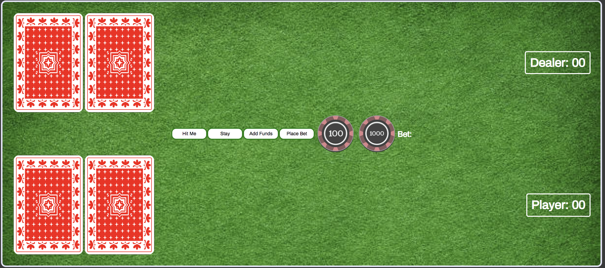
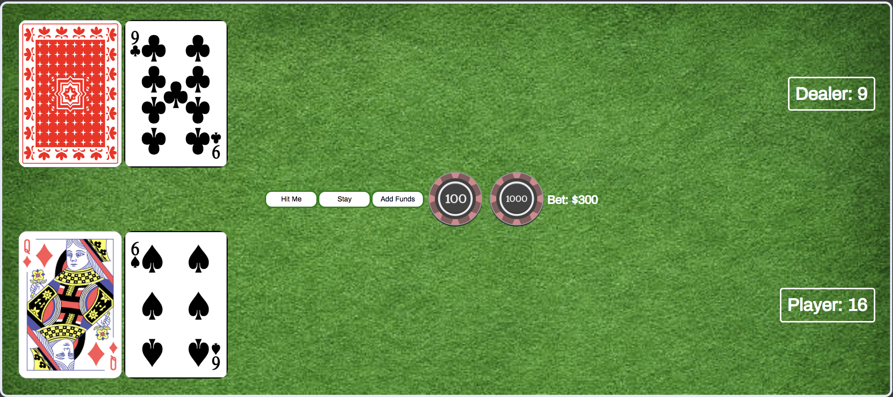
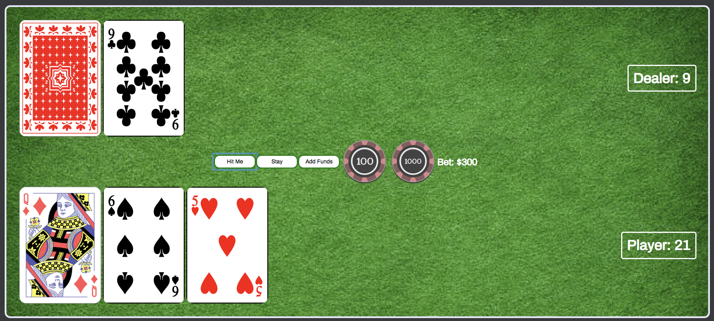
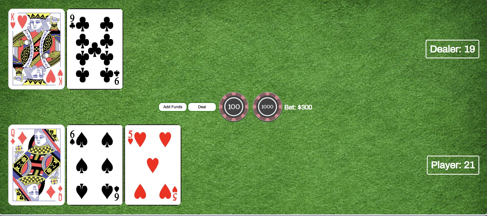
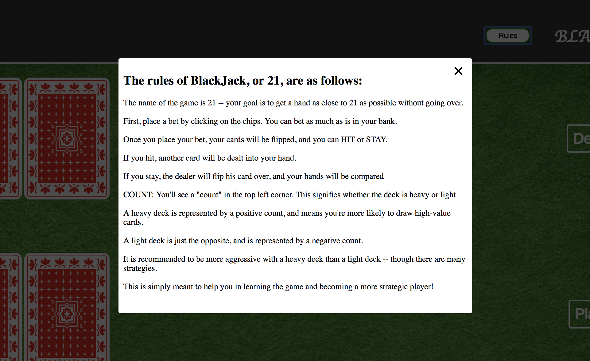

# Black Jack

### Bet Screen:

* Cards are face down prior to bet being placed by user.

* Game begins by user placing a bet. The user has an initial bank of $1000.

* User can click chips worth $100 or $1000. These values get added to the user's Total Bet amount, which can not exceed their bank. Bank is updated after every hand is played.

### Play Screen:

* Once the user has their bet amount set, they can click the place bet button, which will deal (flip) two cards to the user and two cards to the dealer. These cards are removed from the deck.

* The cards will be dealt out of the deck, which will hold one traditional deck. A new deck is played when the cards remaining drops below 20. Each new deck is shuffled before any cards are dealt. Cards are dealt off the top of the deck.

	* If the user has 21, dealer will flip cards. If dealer hand = 21, then the player pushes. No change to player bank. Return to bet screen to bet & deal again.

	* If the user does not have 21, they have the option to hit, stay, or double down. Or split.

### User Hits:

* If user hits, another card will be dealt to user. Can continue to hit if hand amount < 21.

	* If new value > 21, the player busts	and the dealer wins. The bet amount is subtracted from player's bank.

	* If new value < 21, the player has the option to hit or stay again, and the process is repeated.

### User Stays/Dealer Hits:

* If user stays, the dealer will flip over their face-down card. Their hand will be evaluated.

	* If dealer hand < user hand AND dealer hand <= 17 , the dealer draws another card, and this is evaluated again.

	* If dealer hand is between 18 and 21, dealer hand is compared to player hand. If player hand is greater, player wins. If dealer hand is greater, dealer wins. If hands are equal, push.

	* If dealer hand > 21, dealer busts and player wins. Bet amount is added to player's bank.

### Count:
* In the top left hand corner, a running "count" is kept, which may help players improve their strategy as they play the game, and make them a better player in the long run.

* The count is a running total that tells the player whether the deck is heavy (higher probability of flipping a 10, J, Q, K, A) or light (higher probability of flipping a 2, 3, 4, 5, 6), by tracking which cards have already been played.
	* Yes, this is known as counting cards, but it is being done algorithmically in this scenario and is meant as a teaching tool for players to recognize when they should take a more aggressive strategy

### Rules:

* The user must have sufficient funds to place bets. They may add funds to their bank by using the add funds button -- this is meant to simulate a a game with working microtransactions 

* There is a rules button in the top right hand corner that, when clicked, pops open a modal with a short summary of how to play BlackJack and what the "count" means.

### Link:

https://aprudhomme9.github.io/project1/

